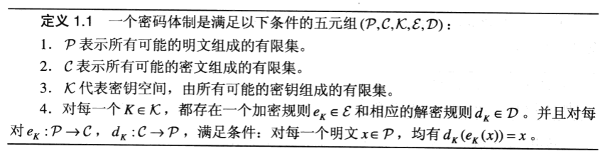
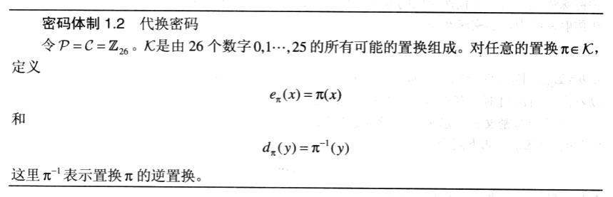
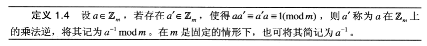
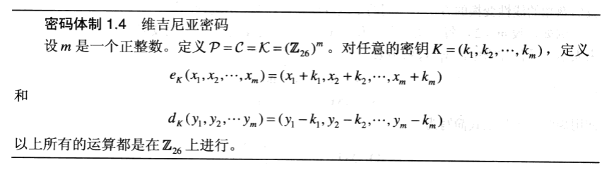
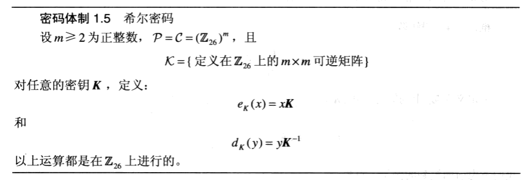
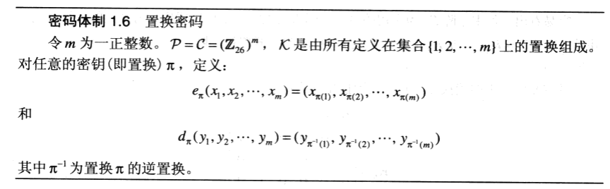
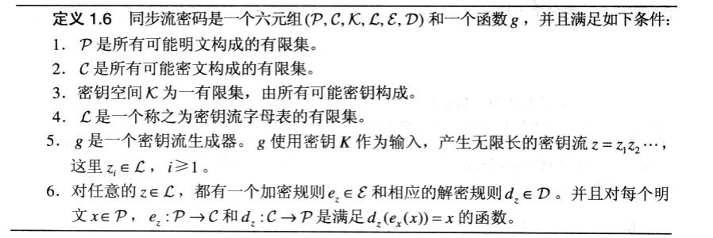
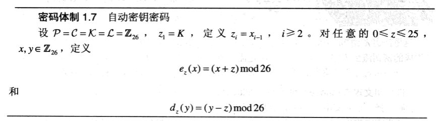
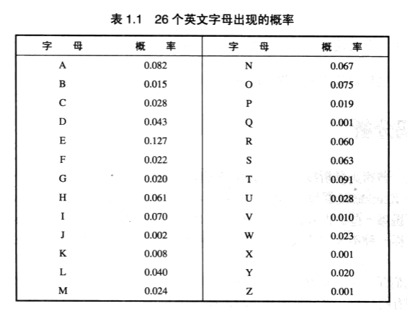

## 1.1 简单的密码体制

### 1.1.1 移位密码 (Shift Cipher)

基础是数论中的模运算。

Python 中的模运算 `a mod m` 恒为一非负值，但 Go 中的模运算 `a mod m` 与 `a` 的正负号相同。

密钥空间太小，可用密钥穷尽搜索方法破译。

### 1.1.2 代换密码 (Substitution Cipher)

无法用密钥穷尽搜索方法短时间破译。

移位密码是代换密码的一种特殊情形。

### 1.1.3 仿射密码 (Affine Cipher)

移位密码是仿射密码的一种特殊情形。

### 1.1.4 维吉尼亚密码 (Vigenere Cipher)

位移密码和代换密码，一旦密钥被选定，则每个字母对应的数字都被加密变换成对应的唯一数字。这种密码体制一般称为单表代换密码。

维吉尼亚密码是一种多表代换密码。

### 1.1.5 希尔密码 (Hill Cipher)

希尔密码是一种多表代换密码。

利用了线性变换、矩阵运算。

### 1.1.6 置换密码 (Permutation Cipher)

前面讨论的密码体制都是代换密码：明文字母被不同的密文字母所代替。

下面讨论的置换密码（Permutation Cipher）的特点是保持明文的所有字母不变，只是利用置换打乱了明文字母的**位置和次序**。

**到达域**（Codomain），或称为**陪域**、余定义域、上域、终域、共变域、目标集（target set）。

在数学领域中，一个函数的到达域指的是至少包含所有此函数的输出值的一个集合。

值域是到达域的一个子集，若f是一个满射函数（surjective function），则f的到达域和值域相等。

#### 单射、满射与双射

在数学定义中，单射、满射和双射是指根据其**定义域**和**陪域**的关联方式所区分的三类函数。

- 单射：指将**不同的变量**映射到**不同的值**的函数。
- 满射：指**陪域等于值域**的函数。
- 双射（也称一一对应或一一映射）：**既是单射又是满射**的函数。直观地说，一个双射函数形成一个对应，并且每一个输入值都有正好一个输出值以及每一个输出值都有正好一个输入值。 

事实上，置换密码是希尔密码的一种特殊情形。

### 1.1.7 流密码 (Stream Cipher)

在前面研究的密码体制中，连续的明文元素是使用**相同的密钥K**来加密的，这种类型的密码体制通常称为**分组密码**（Block Cipher）。

另外一种被广泛使用的密码体制称为**流密码**（Stream Cipher），其基本思想是产生一个**密钥流**，然后使用它根据特定规则来加密明文串。

#### 同步流密码

最简单的流密码是其密钥流直接由初始密钥使用某种特定算法变换得来，密钥流和明文串是相互独立的。这种类型的流密码称为“同步”流密码。

分组密码可看做是流密码的特殊情况，即密钥流为一常数。

#### 异步流密码

在流密码中，还有这样一种情况，密钥流z的产生不但与密钥K有关，而且还与明文元素或密文元素有关，这种类型的流密码称之为异步流密码。

下面给出一个来源于维吉尼亚密码的异步流密码，称为自动密钥密码。称为“自动密钥的原因是因为它使用明文来构造密钥流（除了最初的“原始密钥”外）。当然，由于仅有26个可能的密钥，自动密钥密码是不安全的。

## 1.2 密码分析

前提假设：敌手知道密码体制。

最常见的几类攻击模型如下：

- 唯密文攻击（ciphertext only attack）：敌手只拥有密文串 y。
- 已知明文攻击（known plaintext attack）：敌手拥有明文串 x 及其对应的密文串 y。
- 选择明文攻击（chosen plaintext attack）：敌手可获得对加密机的临时访问权限，这样他能够选择一个明文串 x，并可获得相应的密文串 y。
- 选择密文攻击（chosen ciphertext attack）：敌手可获得对解密机的临时访问权限，这样他能够选择一个密文串 y，并可获得相应的明文串 x。

在上述任何一种模型下，敌手的目标就是确定正在使用的密钥。

### 1.2.1 仿射密码的密码分析

利用密文中出现的26个字母的频数统计猜测然后分析推断。

### 1.2.2 代换密码的密码分析

利用密文中出现的26个字母的频数统计猜测然后分析推断。

### 1.2.3 维吉尼亚密码的密码分析

首先必须确定密钥字的长度m。

### 1.2.4 希尔密码的密码分析

### 1.2.5 LFSR流密码的密码分析
