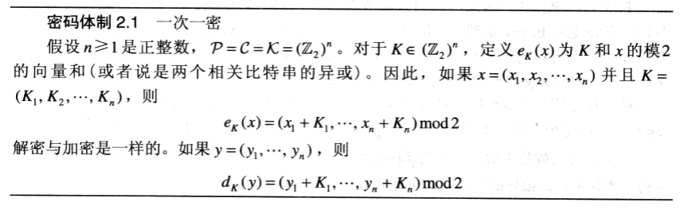
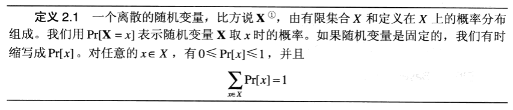
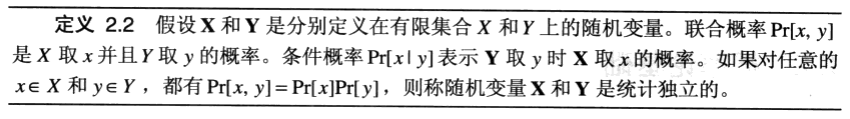
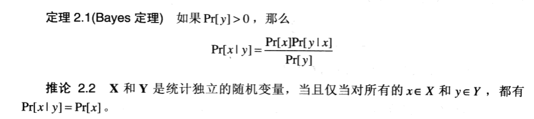
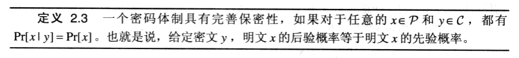
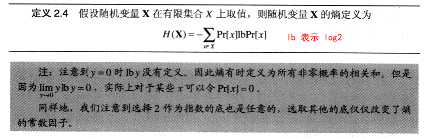
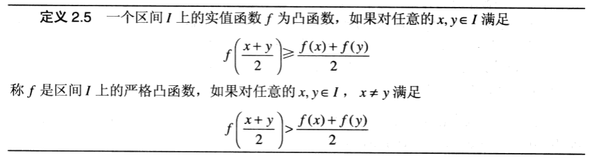
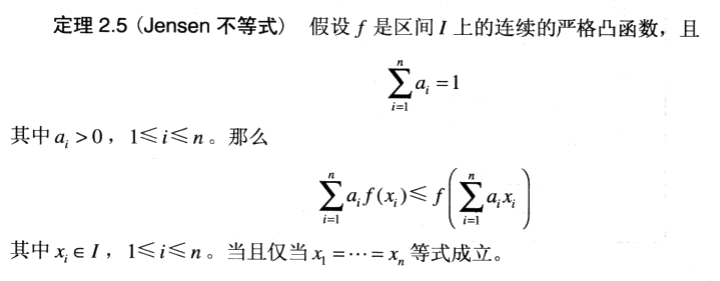
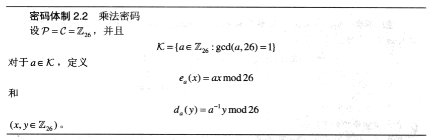

## 2.1 评价密码体制安全性的方法

1. 计算安全性（computational security）

这种度量涉及的是破译一个密码体制所做的计算上的努力。如果使用最好的算法破译个密码体制至少需要N次操作，这里的N是一个特定的非常大的数字，我们可以定义这个密码体制是计算安全的。问题是没有一个已知的实际的密码体制在这个定义下可以被证明是安全的。实际中，人们经常通过几种特定的攻击类型来研究计算上的安全性，例如穷尽密钥搜索攻击。当然对一种类型的攻击是安全的，并不表示对其他类型的攻击也是安全的。

2. 可证明安全性（provable security）

另外一种方法是通过归约的方式为安全性提供证据。换句话讲，如果可用某一具体的方法破译一个密码体制，那么就有可能有效地解决某一被认为困难的经过深入研究的数学问题。例如，可以证明这样一类命题：如果给定的整数n是不可分解的，那么给定的密码体制是安全的。我们称这种类型的密码体制是可证明安全的。但是必须注意的是，这种方法只是说明了安全和某一个问题是相关的，并没有完全证明是安全的。这和证明一个问题是NP完全的有些类似：证明给定的问题至少和任何其他的NP完全问题的难度是一样的，但是并没有完全证明这个问题的计算难度。

3. 无条件安全性（unconditional security）

这种度量考虑的是对攻击者 Oscar的计算量没有限制时的密码体制的安全性。即使提供了无限的计算资源，也是无法被攻破的，我们定义这种密码体制是无条件安全的。在讨论密码体制的安全性的时候，我们同时也规定了正在考虑的攻击类型。

## 2.2 概率论基础

### 2.3 完善保密性

通俗地讲，就是不能通过观察密文获得明文的如何信息。

## 2.4 熵

我们将注意力限制在密钥只能用于一次加密的特殊情况下。现在看看用一个密钥加密多个消息会发生什么，并且还要看看给密码分析人员足够的时间，进行一次成功的唯密文攻击有多大的可能性。

研究这个问题的基本工具是熵（Entropy）。这个概念来自于 Shannon于1948年创建的信息论。熵可以看做是对信息或不确定性的数学度量，是通过一个概率分布的函数来计算的。

### 2.4.1 Huffman 编码

Huffman 算法从集合 X 上的概率分布开始，每个元素的码字最初是空的。在每一个步骤中，两个概率最小的元素组合成一个元素，并以这两个概率的和作为新元素的概率。概率最小的元素赋值为“0”，另一个元素赋值为“1”。当只剩下一个元素时，每个 x ∈ X 的编码可以通过从最后个元素到最初的元素 x“回溯”记录下得到的 0、1 序列而构造出来。

### 2.5 熵的性质

### 2.6 伪密钥和唯一解距离

### 2.7 乘积密码体制

Multiplicative Cipher

明文和密文空间相同的密码体制称为内嵌密码体制。

幂等操作的特点是其任意多次执行所产生的影响均与一次执行的影响相同。幂等函数，或幂等方法，是指可以使用相同参数重复执行，并能获得相同结果的函数。

移位密码、代换密码、仿射密码、希尔密码、维吉尼亚密码和置换密码都是幂等的。

如果一个密码体制是幂等的，使用乘积体制就毫无意义，因为这需要多余的密钥但没有提供更高的安全性。

构造简单的非幂等的密码体制的方法是对两个不同的（简单的）密码体制做乘积。
