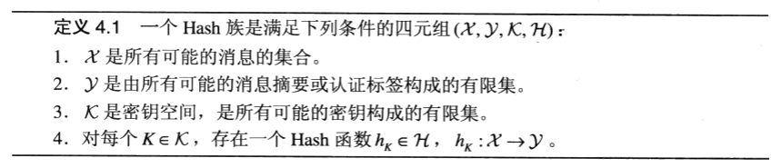
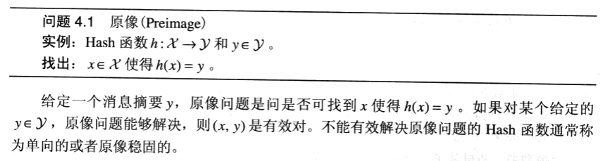
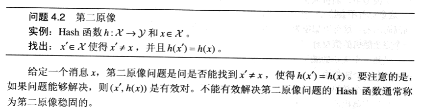
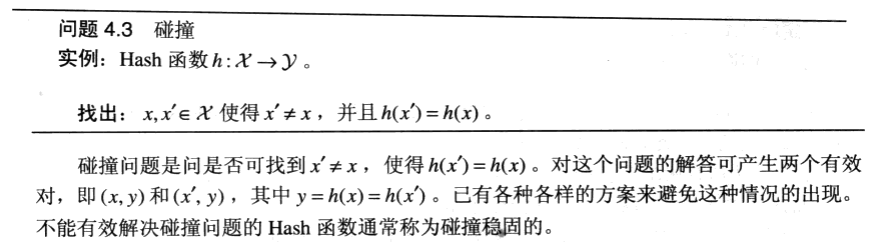

## 4.1 Hash 函数与数据完整性

密码学上的 Hash 函数可为数据完整性提供保障。Hash 函数通常用来构造数据的短“指纹”；一旦数据改变，指纹就不再正确。即使数据被存储在不安全的地方，通过重新计算数据的指纹并验证指纹是否改变，就能够检测数据的完整性。

Hash 函数在数字签名方案中有着特别重要的应用。

一个带密钥的 Hah 函数通常用来作为消息认证码，即 MAC。

由不带密钥的 Hash 函数和带密钥的 Hash 函数各自提供的数据完整性保障是有区别的。用不带密钥的 Hash 函数时，消息摘要必须被安全地存放，不能被篡改。另一方面，如果用秘密密钥 K 来确定所用到的 Hash 函数，他们可以在不安全的信道中同时传送数据和认证标签。

带密钥的 Hash 族定义：

我们可以把不带密钥的Hash函数当做仅仅只有一个密钥的Hash族。

## 4.2 Hash 函数的安全性

1. 原像

2. 第二原像

3. 碰撞

### 4.2.1 随机谕示模型

如果 Hash 函数 h 设计得好，对给定的 x，求出函数 h 在点 x 的值应该是得到 h(x) 的唯一有效的方法。甚至当其他的值已经计算出来，这仍然应该是正确的。

## 4.4 消息认证码

我们现在把注意力转向消息认证码，也就是满足某些安全性质的带密钥的 Hash 函数。我们将看到，MAC 所需要的安全性质与不带密钥的 Hash 函数所需要的安全性质是截然不同的。

构造 MAC 的一个常用方法是通过把一个密钥作为要被 Hash 的消息的一部分，从而在个不带密钥的 Hash 函数中介入一个秘密密钥。可是，为了防止某些攻击，这样做必须很小心。

### 4.4.1 嵌套 MAC 和 HMAC

一个嵌套 MAC 是指合成两个（带密钥的）Hash 族来建立一个 MAC 算法。

HMAC 是一个于 2002 年 3 月被提议作为 FPS 标准的嵌套 MAC 算法。它通过（不带密钥的）Hash 函数来构造 MAC。

### 4.4.2 CBC-MAC

构造一个 MAC 的最常用的方法之一是基于一个固定的（公开的）初始化向量的 CBC 模式。
