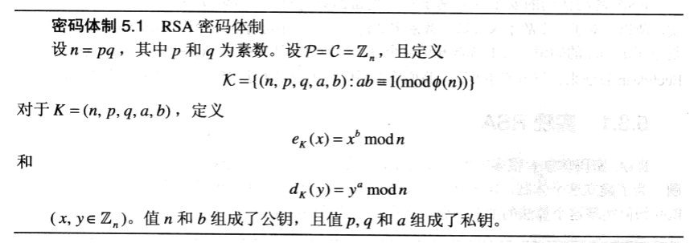
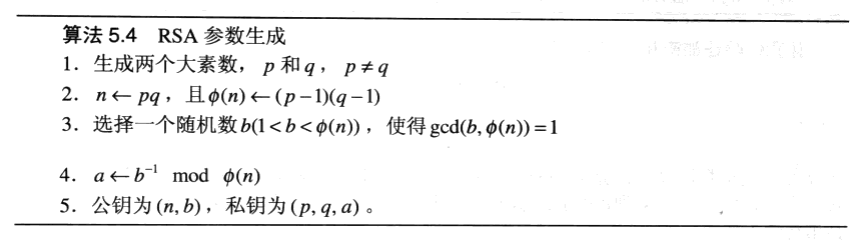

## 5.1 公钥密码学简介

公钥密码体制无法提供无条件安全性。

把公钥密码体制抽象为一种称为陷门单向函数（trapdoor one-way function）的抽象。

尽管有很多单射函数被认为是单向的，但是还没有一个函数能被证明是单向的。

## 5.3 RSA 密码体制

RSA 密码体制的安全性是基于相信加密函数是一个单向函数这一事实，所以，对于一个敌手来说试图解密密文将是计算上不可行的。

## 5.3.1 实现 RSA

## 5.4 素性检测

